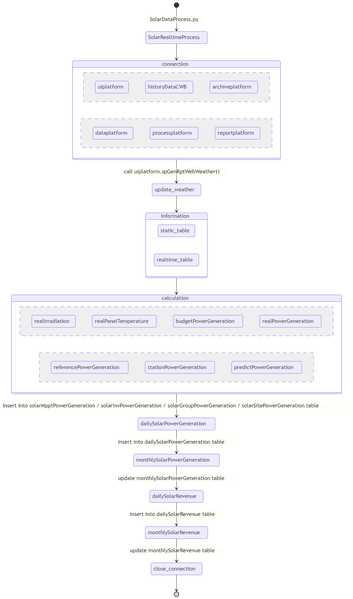
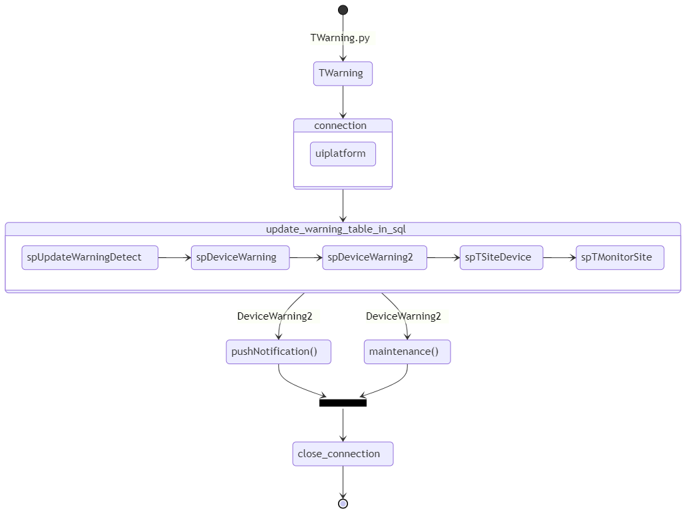
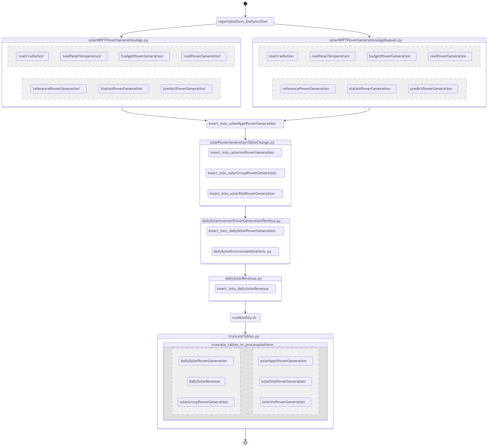

# Solar 文件
目錄
- [Solar 文件](#solar-文件)
  - [Deploy Solar 程式步驟 & 資料夾架構圖](#deploy-solar-程式步驟--資料夾架構圖)
    - [Step 1](#step-1)
    - [Step 2](#step-2)
    - [Step 3](#step-3)
    - [Step 4](#step-4)
    - [Step 5](#step-5)
  - [系統運作流程圖](#系統運作流程圖)
    - [SolarRealtimeProcess](#solarrealtimeprocess)
    - [TWarning](#twarning)
    - [reportplatform_DailyArchive](#reportplatform_dailyarchive)

## Deploy Solar 程式步驟 & 資料夾架構圖
```
.
├── crontab.process.sh
├── solar
│   ├── SolarRealtimeProcess
│   │   ├── archives
│   │   │   ├── dailySolarInverterPowerGenerationPerDay.py
│   │   │   ├── dailySolarInverterPowerGenerationPerHour.py
│   │   │   ├── dailySolarRevenue.py
│   │   │   ├── solarMPPTPowerGenerationAlgoHuawei.py
│   │   │   └── solarPowerGenerationTableChange.py
│   │   ├── flag.txt
│   │   ├── runData_everyMinute.py
│   │   ├── runData_everyMinute_manual.py
│   │   ├── solarDataProcess.py
│   │   └── toolkits
│   │       ├── calculation.py
│   │       ├── connection.py
│   │       ├── dailySolarPowerGeneration.py
│   │       ├── dailySolarRevenue.py
│   │       ├── information.py
│   │       ├── initialization.py
│   │       ├── monthlySolarPowerGeneration.py
│   │       ├── monthlySolarRevenue.py
│   │       └── truncateTables.py
│   ├── TWarning
│   │   ├── TWarning.py
│   │   ├── errorCode.py
│   │   ├── flag.txt
│   │   ├── maintenance.py
│   │   ├── push.py
│   │   ├── spDeviceWarning.txt
│   │   ├── spDeviceWarning2.txt
│   │   ├── spTMonitorSite.txt
│   │   ├── spTSiteDevice.txt
│   │   ├── spUpdateEnvironmentWarning.txt
│   │   ├── spUpdateInverterWarning.txt
│   │   ├── spUpdateMpptWarning.txt
│   │   └── spUpdateWarningDetect.txt
│   └── reportplatform_DailyArchive
│       ├── dailySolarEnvironmentStatistic.py
│       ├── dailySolarInverterPowerGenerationPerHour.py
│       ├── dailySolarRevenue.py
│       ├── dataQuality.py
│       ├── history
│       │   ├── __pycache__
│       │   │   ├── dailySolarInverterPowerGenerationPerHour.cpython-36.pyc
│       │   │   ├── dailySolarRevenue.cpython-36.pyc
│       │   │   ├── solarMPPTPowerGenerationAlgo.cpython-36.pyc
│       │   │   ├── solarMPPTPowerGenerationAlgoHuawei.cpython-36.pyc
│       │   │   └── solarPowerGenerationTableChange.cpython-36.pyc
│       │   ├── dailySolarInverterPowerGenerationPerHour.py
│       │   ├── dailySolarRevenue.py
│       │   ├── monthlySolarPowerGeneration.py
│       │   ├── monthlySolarRevenue.py
│       │   ├── solarMPPTPowerGenerationAlgo.py
│       │   ├── solarMPPTPowerGenerationAlgoHuawei.py
│       │   └── solarPowerGenerationTableChange.py
│       ├── logs
│       ├── monthlySolarPowerGeneration.py
│       ├── monthlySolarRevenue.py
│       ├── runData.py
│       ├── runMonthly.sh
│       ├── runSiteProcess.sh
│       ├── runSite_multiCore.sh
│       ├── site_1.sh
│       ├── site_15.sh
│       ├── site_16.sh
│       ├── site_2.sh
│       ├── site_3.sh
│       ├── site_4.sh
│       ├── site_5.sh
│       ├── site_6.sh
│       ├── site_7.sh
│       ├── solarMPPTPowerGenerationAlgo.py
│       ├── solarMPPTPowerGenerationAlgoHuawei.py
│       ├── solarMPPTPowerGenerationAlgoPickle.py
│       ├── solarPowerGenerationTableChange.py
│       ├── sql
│       │   └── dataQualityBeforeToday.txt
│       └── test.sh
└── sql
    ├── 01_stored procedure and function for etl.sql
    └── 02_views.sql
```
### Step 1
將 `sql` 資料夾裡的所有 `.sql` 貼到 MySQL 執行。
執行完後應該在 `uiplatform` 的看到 `views` 與 `stored procedure` 裡看到程式。 

### Step 2
放置好 `solar` 程式碼資料夾後，更改 `crontab.process.sh` 中所有路徑到相對應位置。(這裡使用絕對位置)

### Step 3
設置 Python 環境，及安裝相關套件。  

```
# 系統層面
sudo apt install python3-pip
sudo apt install libmysqlclient-dev

# Python 層面
sudo pip3 install sqlalchemy==1.3.17
sudo pip3 install mysqlclient
sudo pip3 install pymysql
sudo pip3 install requests
sudo pip3 install pandas numpy
```

### Step 4
執行 `bash crontab.process.sh` 即可。

### Step 5
可至 `crontab -e` 查詢有沒有更新到 crontab 上。

## 系統運作流程圖
###  SolarRealtimeProcess

### TWarning

### reportplatform_DailyArchive

